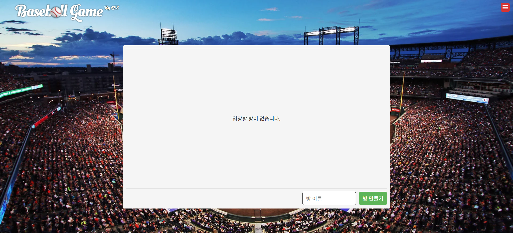
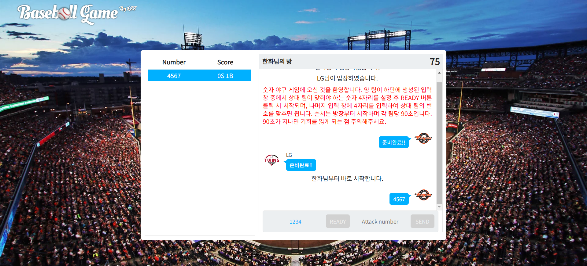

# Number Baseball App - Online

Socket.io를 이용한 실시간 숫자 야구 게임입니다.

## 제작 동기

이모가 좋아하시는 숫자 야구를 다양한 사람들과 실시간으로 즐길 수 있도록 만들면 재밌을 것 같아서 시작했습니다.

## 사용 기술

### Client

- **Typescript**

  여러 변수와 함수를 사용할 것이므로 개발의 편리성과 컴파일 단계에서 디버깅을 하기 위해 사용했습니다.

- **React**

  게임의 화면이 전환될 때 깜빡임이 없도록 SPA로 만들 필요가 있었고, Javascript 문법이 익숙했기에 자체적인 문법이 있는 Vue, Angular보다는 React를 사용했습니다. 또한 React의 사용자가 많으므로 개발하는 과정에서 생기는 문제들을 해결하기에 더욱 용이할 것으로 생각했습니다.

### Server

- **Node.js**

  Javascript 문법이 익숙했기에 사용했습니다.

- **Express**

  서버를 쉽게 구축할 수 있는 프레임워크이기 때문에 사용했습니다. 또한 React와 마찬가지로 사용자가 많으므로 개발하는 과정에서 생기는 문제들을 해결하기에 더욱 용이할 것으로 생각했습니다.

- **Socket.io**

  클라이언트와 서버 간의 실시간 통신을 쉽게 사용하기 위해 사용했습니다.

## 문제 해결 및 추가 사항

### 문제 해결

- Client단에서 제한 시간(sec)을 설정하면 사용자의 환경에 따라 시간이 다르게 표시되는 문제를 Server단에서 시간을 설정하여 각 사용자에게 전달하는 것으로 해결했습니다.
- CORS의 문제를 해결하기 위해 Server단에서 cors 라이브러리를 설치했습니다.

### 추가 사항

- 제대로 된 로그인 기능
- 방 생성 시 비밀번호 설정 기능
- 사용자 전체 대화 기능

## 배운 점

- Web Socket과 HTTP의 차이
- CORS의 정의

## Demo

[바로 가기](https://web-number-baseball-app-client-1fk9002blr1v8kg3.sel5.cloudtype.app/) (AM 03:00 ~ AM 09:00에는 서비스 중지)

## 로컬 설치

git을 clone 한 후에 따라 해주세요.

```bash
# 모든 모듈 설치
npm run ins

# 실행
npm run dev
```

## Screenshots
#### 메인

#### 대기실

#### 게임시작

